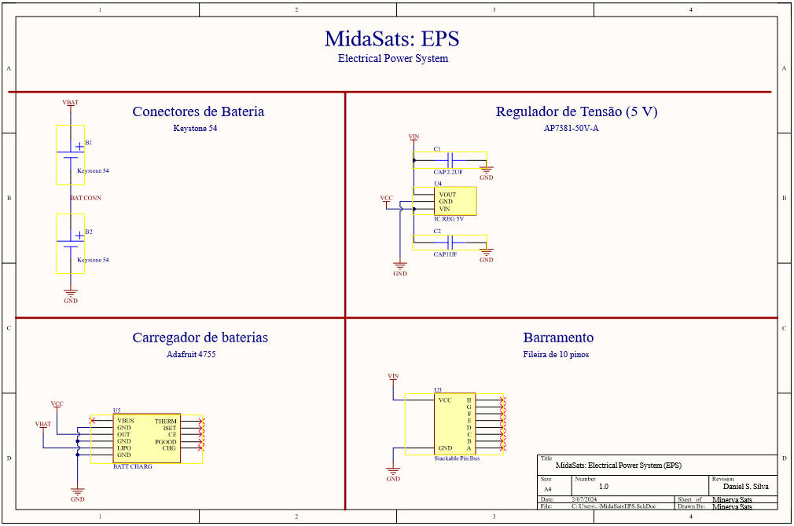
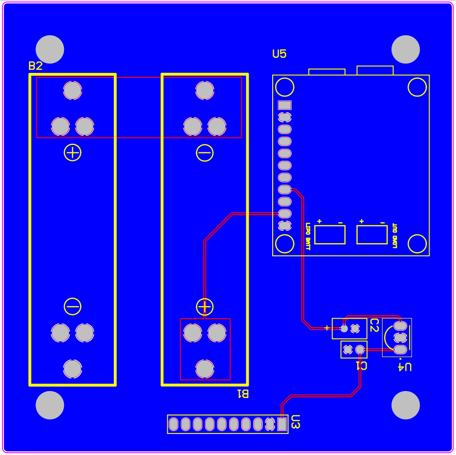
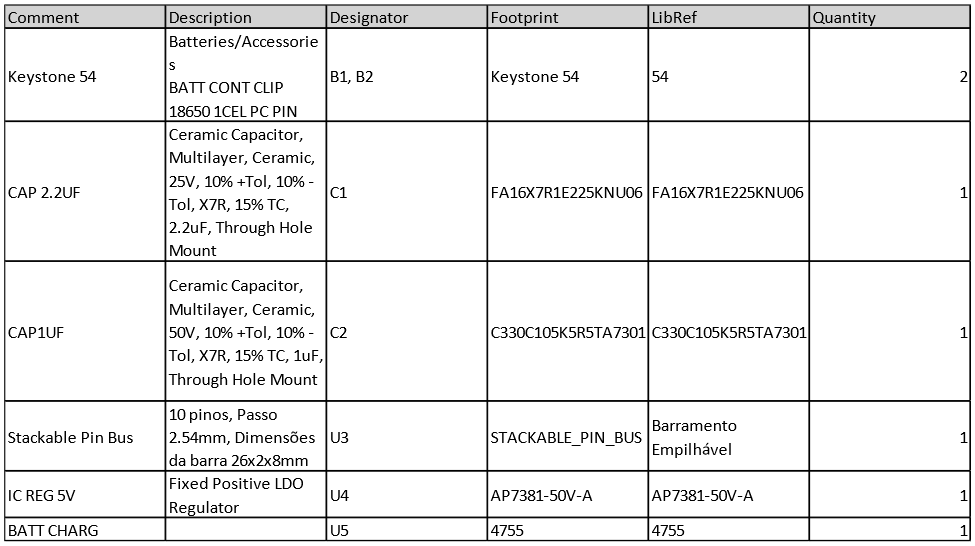
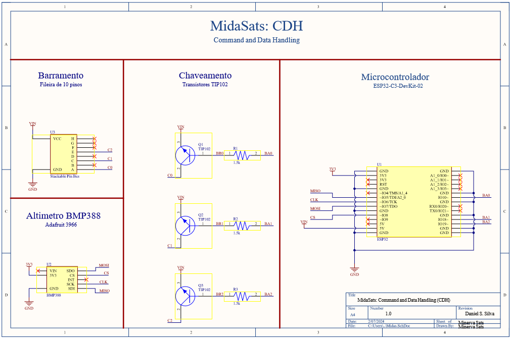
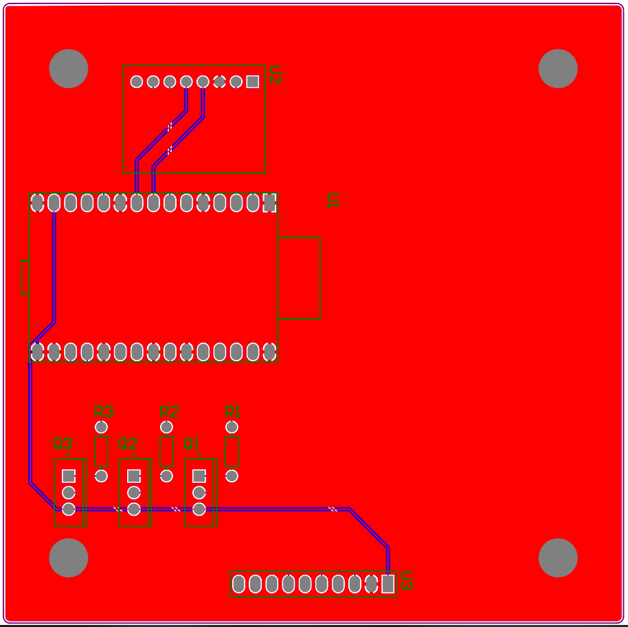
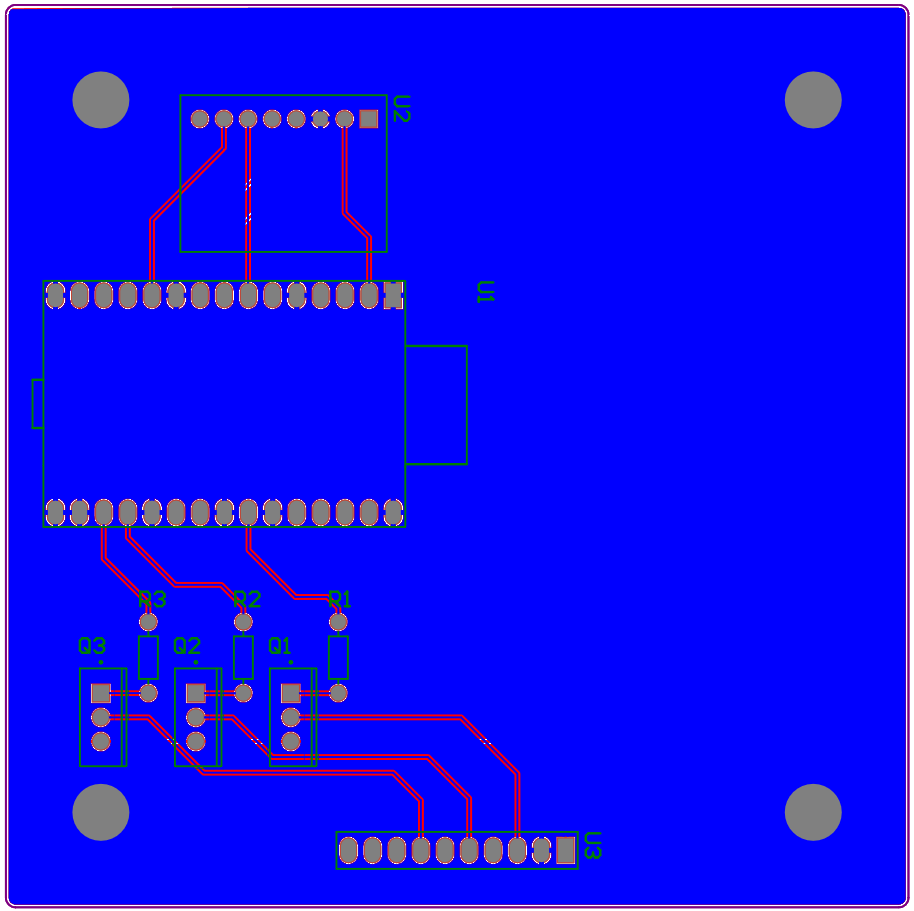
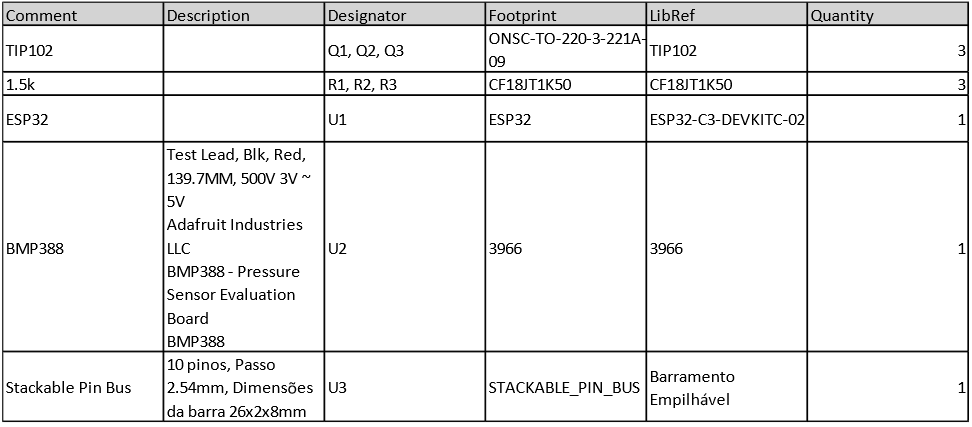
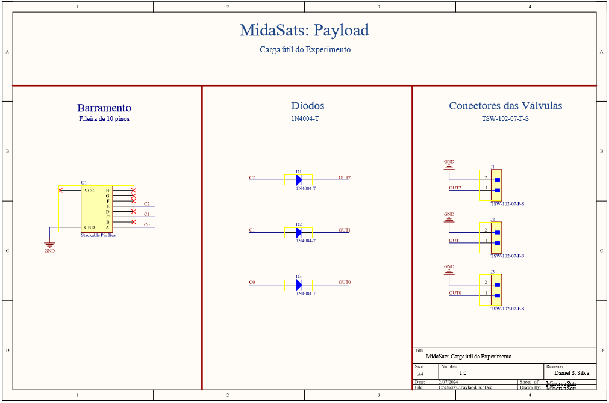
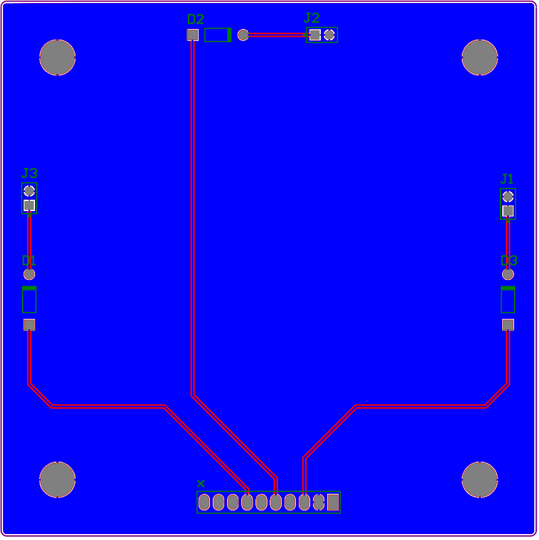

## MidaSats: Repositório do Projeto CubeSat

**MidaSats** é um projeto de CubeSat 1U que visa estudar a síntese de nanopartículas em ambiente espacial. Este repositório Git armazena o design das PCBs do projeto, desenvolvidas no Altium Designer.

**Objetivo da Missão:**

* Garantir a integridade e funcionamento do satélite durante a missão (lançamento e recuperação).
* Obter dados relevantes sobre o experimento de síntese de nanopartículas.

**Requisitos Gerais:**

* Acomodação de uma plataforma de síntese de nanopartículas.
* Dimensões de acordo com o padrão CubeSat 1U (R.14 do CDS).
* Estrutura capaz de acomodar a carga útil e a eletrônica embarcada.
* Bateria com autonomia suficiente para toda a missão.
* Peso máximo de acordo com o padrão CubeSat 1U.
* Detecção da altitude do foguete e interrupção da síntese em cada poço (uso de inibidor).

**Placas do Projeto:**

* **EPS (Electrical Power System):** fornece energia para todo o satélite.
* **CDH (Command and Data Handling):** controla o satélite e armazena os dados coletados.
* **Payload (Carga útil):** plataforma de síntese de nanopartículas.

**Imagens e Layouts:**

**EPS:**

* **Esquema:** 
* **Bottom Layer:** 
* **Componentes:** 

**CDH:**

* **Esquema:** 
* **Top Layer:** 
* **Bottom Layer:** 
* **Componentes:** 

**Payload:**

* **Esquema:** 
* **Bottom Layer:** 

**Metodologia de Fabricação:**

O projeto utiliza uma metodologia de fabricação conhecida e utilizada pela Minerva Sats, visando minimizar custos e garantir confiabilidade.

**Contribuições:**

Agradecemos a todos que contribuem para o desenvolvimento do MidaSats. Para mais informações ou para contribuir com o projeto, entre em contato com a Minerva Sats.

**Licença:**

Este repositório está licenciado sob a licença MIT.
